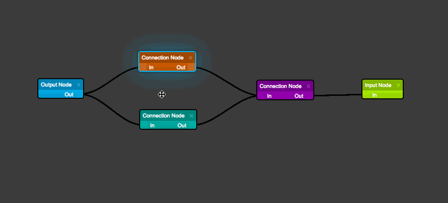
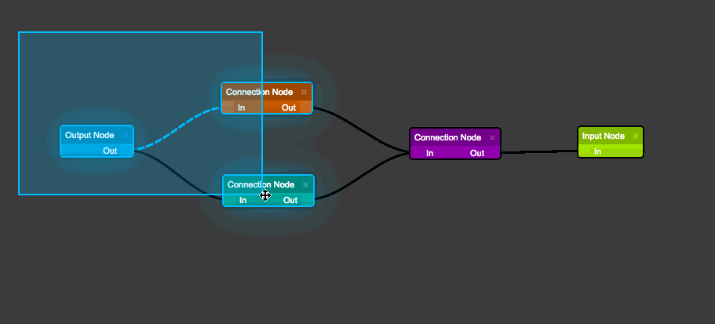
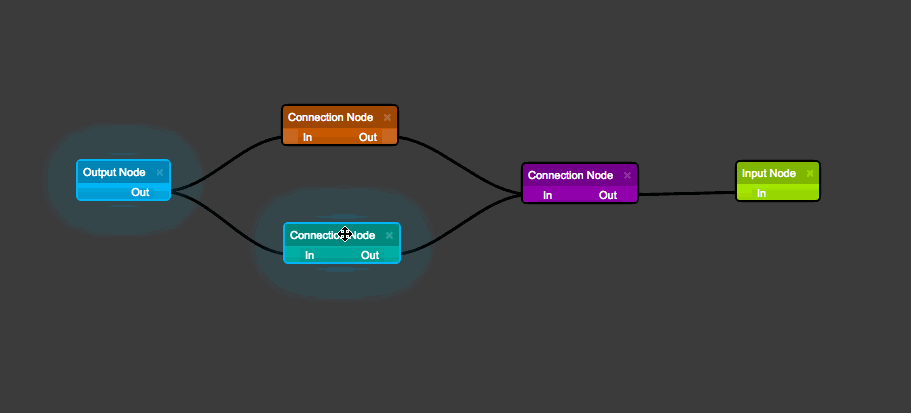
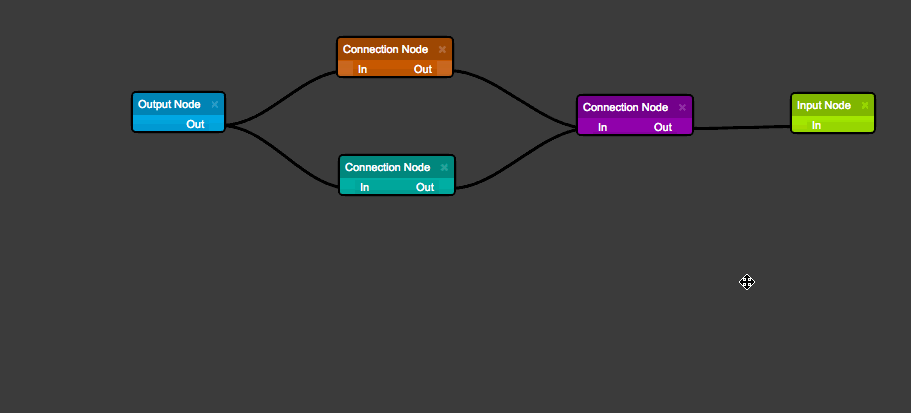
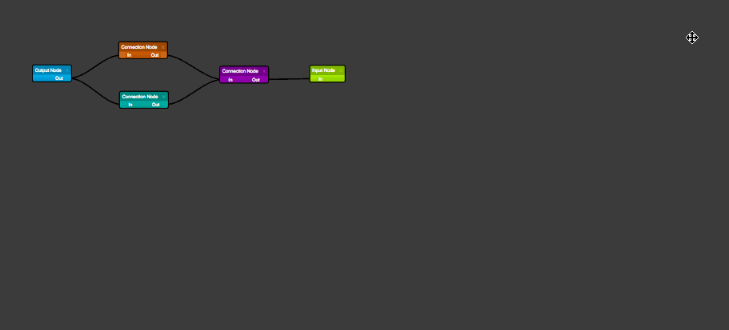
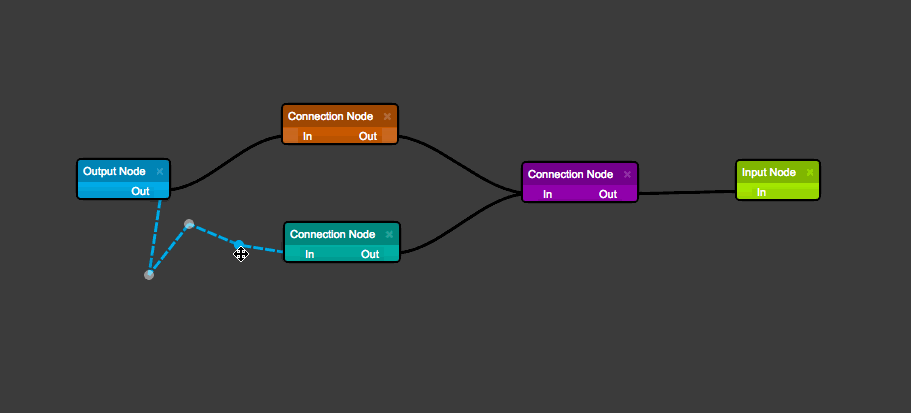
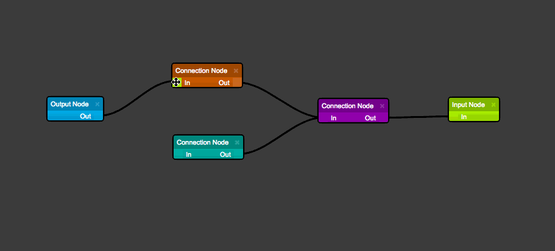

# React JS Diagrams - ERD Example

Drag and drop ERD example created by @MasterIsuru

## Viewing The Examples / Developing

From the repository directory, ensure you've run `npm install` then run `npm start` to spin up the development server and navigate to `http://localhost:3000`.

Alternatively, you can run `./node_modules/.bin/webpack` from the repository directory to build the demo bundles and run them from the file system.

## How Does It Work

The library uses a Model Graph to represent the virtual diagram and then renders the diagram using
2 layers:
* Node Layer -> responsible for rendering nodes as React components
* Link Layer -> responsible for rendering links as SVG paths

## Keyboard / Mouse Commands

__Delete__ removes any selected items


__Shift + Mouse Drag__ triggers a multi-selection box


__Shift + Mouse Click__ selects the item (items can be multi-selected)


__Mouse Drag__ drags the entire diagram


__Mouse Wheel__ zooms the diagram in / out


__Click Link + Drag__ creates a new link point


__Click Node Port + Drag__ creates a new link


__Ctrl or ⌘ + C__ copy any selected items; note that only links that belong to a selected source node will
be copied to the internal clipboard

__Ctrl or ⌘ + V__ paste items previously copied to the internal clipboard

__Ctrl or ⌘ + A__ select all items

__Ctrl or ⌘ + D__ deselect all items

## Disable Actions / Key Commands

The diagram widget accepts an `actions` property which is an object containing specific keys with boolean values that disable / enable the given action. If a specific key isn't passed it will be enabled by default (passing null will disable all actions).

#### Example

The following example disables the keyboard commands listed in the below `actions` prop.

```javascript
render() {
  return (
    <RJD.DiagramWidget
      diagramEngine={engine}
      actions={{
        deleteItems: false,
        copy: false,
        paste: false,
        selectAll: false,
        deselectAll: false
      }}
    />
  );
}
```

#### Supported Keys


__deleteItems__ The deletion of items via delete keypress

__selectItems__ The ability to select any item,

__moveItems__ The ability to move items,

__multiselect__ Shift selecting items,

__multiselectDrag__ Multiselect box selection of items,

__canvasDrag__ Dragging the canvas to move items,

__zoom__ Zoom in / out by mouse wheel,

__copy__ Copy items keyboard command,

__paste__ Paste items keyboard command,

__selectAll__ Select all keyboard command,

__deselectAll__ Deselect all keyboard command
